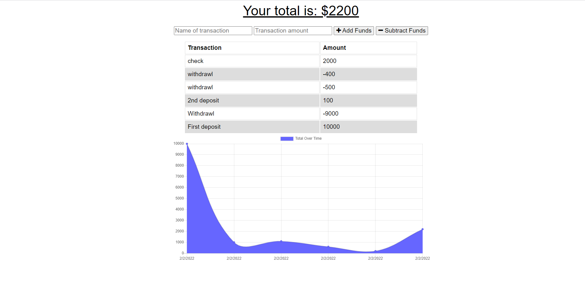

# PWA-Budget-Tracker

## Description
A budget tracker is an application that tracks the amount of money being spent or received. This application is capable of tracking transactions with or without an internet connection. When a user tries to update their finances with no internet connection the application will automatically update once the connection returns. This application was created to help people keep track of their finances while on any device wherever they are located. 

## Tracker Preview

## Tools
* Express
* MongoDB
* Heroku
* Service-Workers

## Usage
In order to use this application the following must done:
1. Copy the code from this repository
2. Install the proper dependencies using `npm install`
3. Test the application while online and offline. This can be done by using Chrome DevTools by doing the following:
    * Open the Inspect tool and search for the Network tab towards the top
    * Right below the Network tab change the internet connections from either `Fast 4G` or `Slow 4G` to `Offline`. Doing this simulates using the application without internet connection

## Deployed Application
https://pwa-budget-tracker-bc.herokuapp.com/